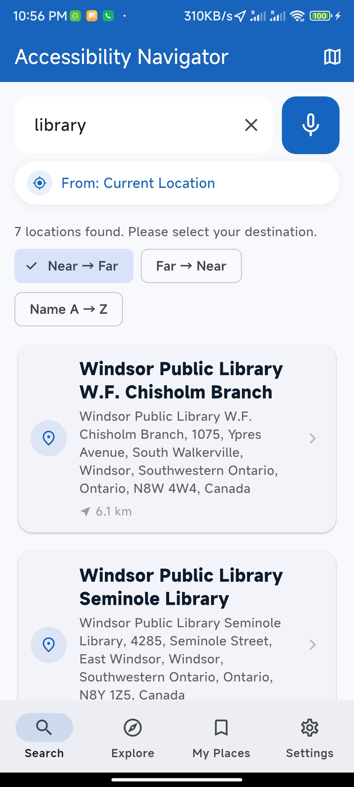
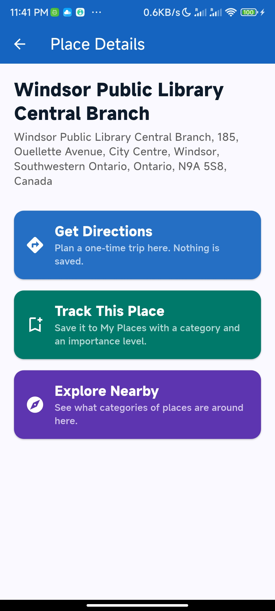
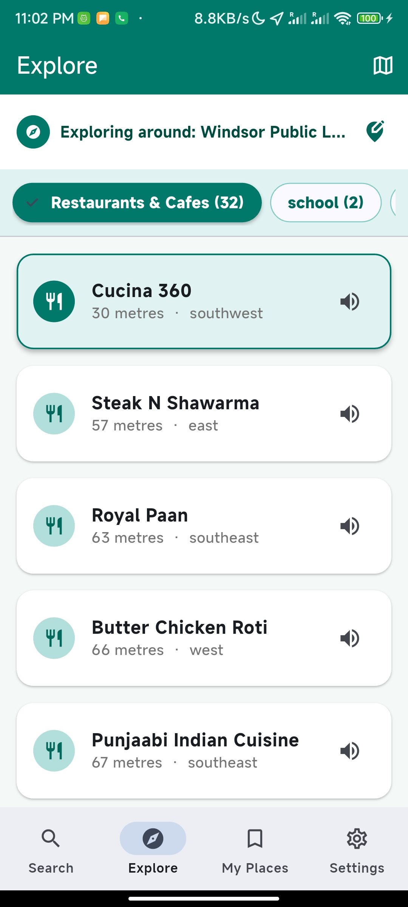
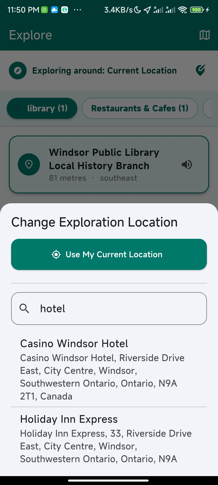
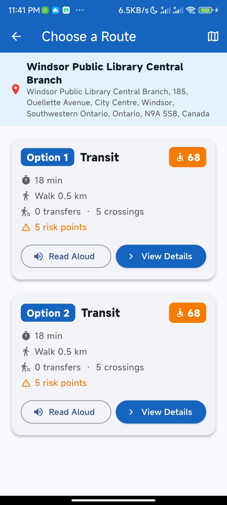
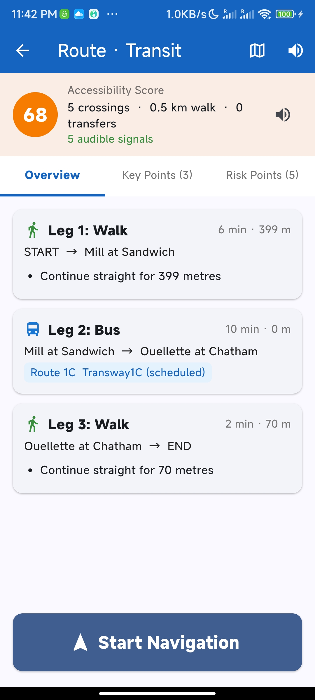
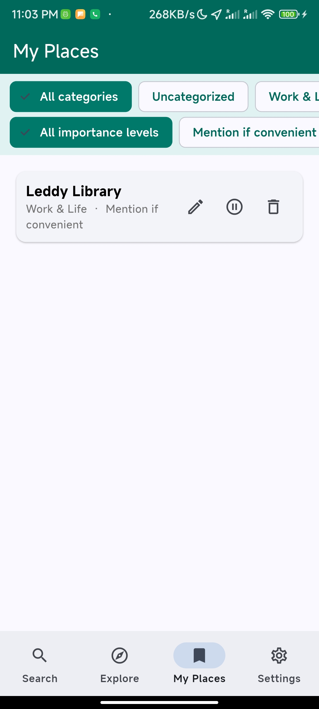
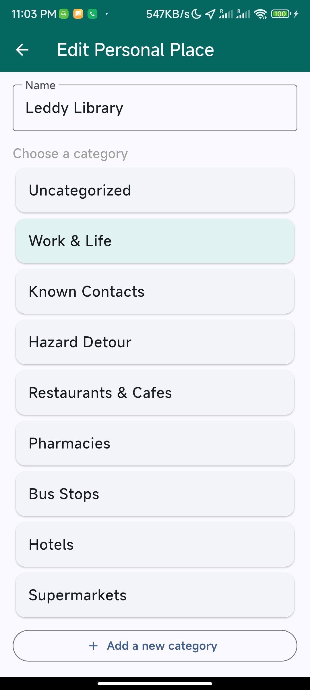

# EasyPath

A pedestrian navigation assistant for visually impaired users, built around Windsor, Ontario. Every screen and announcement is designed to be driven by voice and text-to-speech rather than by reading a map.

Originally an idea from Hackforge, a Windsor, Ontario community technology hub.


| Search                               | Explore                                | Route detail                                     | My Places                                  |
| ------------------------------------ | -------------------------------------- | ------------------------------------------------ | ------------------------------------------ |
|  |  |  |  |

## What it does

- **Search & directions** — find a destination, plan walking / bus / taxi routes, and get a per-route accessibility score (crossings, transfers, audible signals, construction alerts).
- **Real-time navigation** — turn-by-turn voice instructions driven by live GPS + compass, off-route detection, and vibration alerts for upcoming functional points (bus stops, entrances) and risk points (crossings, construction).
- **Explore** — ask what's around any point (current location or a searched place) grouped by category (restaurants, pharmacies, bus stops, …), read aloud on request.
- **Personal places ("My Places")** — bookmark places that matter to a specific user (e.g. a pharmacy, a friend's building), tag them by how urgently they should be announced, and get proximity alerts for them automatically while navigating nearby — even on a route that was never planned to pass them.

## A worked example

Riley wants a coffee near the Windsor Public Library, then wants to make sure they get alerted the next time they're near a pharmacy they rely on.

1. **Search** — Riley speaks "Windsor Public Library" into the Search tab's mic button. The app reads back the results; Riley picks one and lands on its place detail page.
2. **Directions** — Riley taps **Get Directions**. The app plans walking / bus / taxi options from the current GPS position and reads out each route's duration and accessibility score. Riley picks the,bus route, reviews its key points and risk points, and taps **Start
   Navigation**.
3. **Navigation** — the app announces each instruction, the facing direction, and progress as Riley walks and rides. A vibration pulses when a bus-boarding point or a street crossing is close, and the app speaks up if Riley drifts off the planned path.
4. **Explore** — after arriving, Riley switches to the **Explore** tab (still centred on the library) and asks for nearby cafés. The app groups results by category and reads out the closest one's name, distance, and direction. Riley opens a café's detail page and taps **Track This Place**, picking a category and an importance level
   ("remind me if convenient").
5. **My Places** — later, Riley opens the **My Places** tab, finds the pharmacy they bookmarked months ago, and marks it "must remind me nearby" — the highest urgency tier. From now on, any walk that passes within range of that pharmacy triggers a proximity alert automatically, regardless of whether it was the planned destination.

## Architecture

```
backend/    FastAPI service — place search, route planning, nearby exploration. Proxies to:
            - MOTIS (self-hosted) for transit + walking routing
            - Overpass API for nearby-place / category queries
            - Nominatim for place search / geocoding
```

The client is being rewritten as a native iOS/SwiftUI app for tighter
VoiceOver integration. The previous Flutter client (iOS/Android/desktop,
voice-first UI, real-time navigation engine, local personal-places
storage) is preserved on the [`flutter-legacy`](../../tree/flutter-legacy)
branch and still works against the same `backend/` API.

## Getting started

```bash
# Backend (FastAPI + MOTIS)
cd backend
docker compose up -d
```

MOTIS needs an imported OSM/GTFS dataset under `backend/motis/data/`
before route planning will return results. For the client, check out
the `flutter-legacy` branch (see above) or watch this space for the
new SwiftUI app.

## Testing

```bash
cd backend/fastapi && pytest
```

## Safety notice

This app uses open data (OpenStreetMap, Transit Windsor) that may be incomplete or outdated, and does not replace checking actual conditions on the ground. The app shows this disclaimer on first launch.

## License

This project is licensed under the [MIT License](LICENSE).
